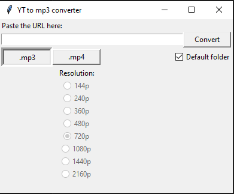

# YouTube to .mp3/.mp4 converter

This is a converter I made for myself for when I download videos from YouTube.

## Requirements

The packages I used for the converter are the following:\
`tkinter` -> `pip3 install tk`\
`pytubefix` -> `pip3 install pytubefix`\
`moviepy` -> `pip3 install pytube moviepy`\
and of course the latest version of Python, in this case it was Python 3.12.3.

Tkinter package was used for the layout of the app.\
Pytubefix was used for the converting and downloading the video from YouTube.\
Moviepy was used for saving the files to the device, and for combining the audio and video files into a single video when downloading .mp4 files.

## The app

This is what the layout of the app looks like:

It works by pasting the URL of the video you want to convert into the entry bar near the top and clicking the `Convert` button which immediately downloads the file to either the default folder or a folder of your choosing (depending on whether the `default folder` checkbox is checked or not). Before converting and downloading the video, you can choose which format you want to download with the buttons below the entry bar. Additionally, if you want to download an .mp4 file, you have to choose which resolution you want to download (the default resolution is 720p). If YouTube doesn't have the video in that resolution, and error will pop up below the resolution radio buttons asking you to choose a different resolution.

The `.mp3` and `.mp4` buttons are configured in a radio button-like way, such that clicking one unclicks the other.\
The resolution radio buttons are disabled when downloading .mp3 files.\
If the `default folder` checkbox is unchecked, you will be asked to choose a download folder every time you want to download a video.

## Sources used

This is a list of some of the sources I used that helped in one way or another:\
[https://realpython.com/python-gui-tkinter/](https://realpython.com/python-gui-tkinter/)\
[https://tkdocs.com/tutorial/index.html](https://tkdocs.com/tutorial/index.html)\
[https://docs.python.org/3/library/tkinter.ttk.html](https://docs.python.org/3/library/tkinter.ttk.html)\
[https://medium.com/python-and-machine-learning-pearls/how-to-convert-youtube-videos-to-mp3-in-python-36173a571be9](https://medium.com/python-and-machine-learning-pearls/how-to-convert-youtube-videos-to-mp3-in-python-36173a571be9)\
[https://stackoverflow.com/questions/72965406/no-sound-in-video-downloaded-from-youtube-using-pytube](https://stackoverflow.com/questions/72965406/no-sound-in-video-downloaded-from-youtube-using-pytube)\
[https://github.com/JuanBindez/pytubefix/issues/128](https://github.com/JuanBindez/pytubefix/issues/128)

There are more, but I didn't document each and every source I used.

